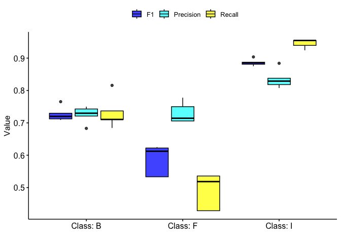
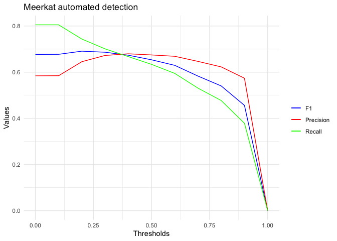

<!-- README.md is generated from README.Rmd. Please edit that file -->

# Transfer-learning-open-data

<!-- badges: start -->
<!-- badges: end -->

The goal of Transfer-learning-open-data is to use BirdNET transfer
learning on open datasets for classification and automated detection

# Supervised classification using cat’s meow dataset

Data is described here: <https://doi.org/10.1007/978-3-030-67835-7_20>

## Methods

Randomly divided the data into a 70/30 split with 70% used for training
and 30% used for testing. Use BirdNET transfer learning to train and
subsequently classify the test dataset.

<!-- -->

# Automated detection using meerkat data

Data is described here:
<https://dcase.community/challenge2023/task-few-shot-bioacoustic-event-detection>

## Methods

We used the annotations to put the meerkat clips into training folders
to train BirdNET. We then ran the trained model over a 43-min file and
used the ‘ohun’ r package to calculate performance metrics. In the
‘ohun’ package you specifiy an overlap parameter, that was difficult to
decide as BirdNET returns 3-sec clips but the meekkat clips are shorter.

<!-- -->
